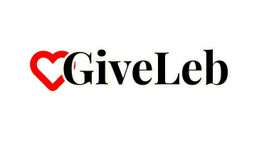

# GiveLeb - Donation Platform for Lebanon

<div align="center">
  
  
  **A comprehensive donation platform connecting donors with those in need across Lebanon**
  
  [](https://nextjs.org/)
  [](https://laravel.com/)
  [](https://www.typescriptlang.org/)
  [](https://www.php.net/)
</div>

## 🌟 Overview

GiveLeb is a modern, full-stack donation platform designed specifically for Lebanon, enabling seamless connections between generous donors and individuals or organizations in need. The platform combines cutting-edge technology with user-centric design to create a transparent, secure, and efficient donation ecosystem.

## ✨ Key Features

### 🎯 Core Functionality
- **Donation Management**: Create, manage, and track donation requests and offers
- **Real-time Matching**: Intelligent matching system between donors and recipients
- **Secure Transactions**: Safe and transparent donation processing
- **Location-based Services**: Geographic filtering and location-specific donations

### 👥 User Management
- **Role-based Access Control**: Admin and User roles with specific permissions
- **User Verification System**: Identity verification for enhanced trust and security
- **Profile Management**: Comprehensive user profiles with donation history
- **Authentication**: Secure login/registration with password recovery

### 🏘️ Community Features
- **Community Posts**: Share stories, updates, and engage with the community
- **Commenting System**: Interactive discussions on posts and donation events
- **Voting System**: Community-driven content curation
- **Blog Platform**: Educational content and platform updates

### 📊 Administrative Dashboard
- **Statistics & Analytics**: Comprehensive platform metrics and insights
- **User Management**: Admin tools for user oversight and moderation
- **Content Moderation**: Review and manage community posts and comments
- **Announcement System**: Platform-wide announcements and notifications
- **Verification Management**: Handle user verification requests

### 🔔 Communication
- **Notification System**: Real-time notifications for important events
- **Email Integration**: Automated email notifications and updates
- **Activity Tracking**: Comprehensive audit trail of user actions

## 🏗️ Technical Architecture

### Frontend Stack
- **Framework**: Next.js 15.4.2 with React 19
- **Language**: TypeScript 5
- **Styling**: Tailwind CSS 4 with custom components
- **UI Components**: Radix UI primitives for accessibility
- **State Management**: Zustand for client state
- **Data Fetching**: TanStack Query (React Query) for server state
- **Forms**: React Hook Form with Zod validation
- **Animations**: Framer Motion for smooth interactions
- **Theme**: Next-themes for dark/light mode support

### Backend Stack
- **Framework**: Laravel 12+ with PHP 8.2+
- **Authentication**: Laravel Sanctum for API authentication
- **Authorization**: Spatie Laravel Permission for role-based access
- **Database**: SQLite (development)
- **Image Processing**: Intervention Image for file handling
- **API**: RESTful API with comprehensive resource controllers

### Development Tools
- **Package Managers**: pnpm (frontend), Composer (backend)
- **Code Quality**: ESLint, Laravel Pint for code formatting
- **Testing**: PHPUnit for backend testing
- **Development**: Turbopack for fast development builds

## 📁 Project Structure

```
GiveLeb/
├── frontend/                 # Next.js Frontend Application
│   ├── src/
│   │   ├── app/             # App Router pages and layouts
│   │   │   ├── admin/       # Admin dashboard pages
│   │   │   ├── blog/        # Blog and content pages
│   │   │   ├── community/   # Community features
│   │   │   ├── donations/   # Donation management
│   │   │   └── profile/     # User profile pages
│   │   ├── components/      # Reusable React components
│   │   │   ├── ui/          # Base UI components (Radix UI)
│   │   │   ├── admin/       # Admin-specific components
│   │   │   ├── auth/        # Authentication components
│   │   │   └── common/      # Shared components
│   │   ├── contexts/        # React contexts for state management
│   │   ├── lib/            # Utility functions and API clients
│   │   └── types/          # TypeScript type definitions
│   ├── public/             # Static assets and images
│   └── data/               # Mock data and content
├── backend/                # Laravel Backend API
│   ├── app/
│   │   ├── Http/
│   │   │   ├── Controllers/API/  # API controllers
│   │   │   ├── Requests/         # Form request validation
│   │   │   └── Resources/        # API resource transformers
│   │   ├── Models/              # Eloquent models
│   │   ├── Policies/            # Authorization policies
│   │   └── Services/            # Business logic services
│   ├── database/
│   │   ├── migrations/          # Database schema migrations
│   │   └── seeders/            # Database seeders
│   └── routes/                 # API route definitions
└── docs/                   # Documentation files
```

## 👥 Team

Meet the talented team behind GiveLeb:

- **Nour Al Hazzouri** - Team Leader, Front-end Developer
- **Mariam Kanj** - UI/UX Designer, Front-end Developer  
- **Ali Atat** - Front-end Developer
- **Ayman DanDan** - Back-end Developer
- **Mouhamad Moussa** - Back-end Developer

---

<div align="center">
  <strong>Making a difference, one donation at a time 🇱🇧</strong>
</div>
